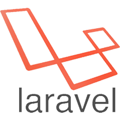
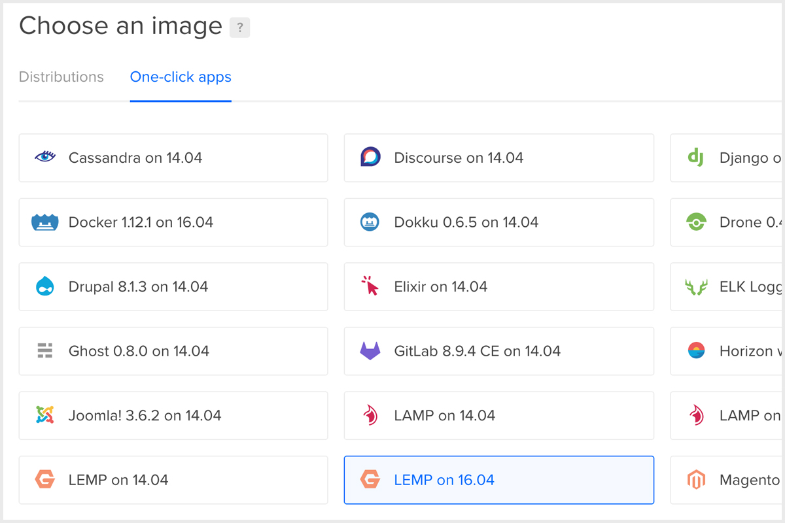

[1]: https://www.digitalocean.com/
[2]: https://www.laravel.com/
[3]: https://forge.laravel.com/
[4]: https://cloud.digitalocean.com/droplets/new

<p align="center">
    
    <br>
    <a href="https://www.digitalocean.com/"></a>
    <a href="#"></a>
    <a href="https://laravel.com/"></a>
    &nbsp; &nbsp; &nbsp;
    <a href="#"></a>

</p>

<br><br>

There is an official service called [Forge][3] from [Laravel][2] which 
will setup your [DigitalOcean][1] *Droplets* for you in no time and 
I totally love it. *Forge* has an incredible UI and it was a pleasure for me
to use it for months and I strongly recommend you to at least try it, 
but if you are like me and want to know what happens behind the scenes 
and if you want to know how to setup your *Droplets* by yourself, 
then this step-by-step guide is for you.

In this step-by-step guide I will show you how to setup your *DigitalOcean Droplets* and run your *Laravel* applications on them. 

> **Note:** I want to keep this guide as short as possible and 
> I won't include here all the details, so if you feel that 
> you don't understand something then Google is your friend.

<br>

## Table of Contents

- [1. Getting Started](#1-getting-started)
    + [1.1. Create the Droplet](#11-create-the-droplet)
    + [1.2. Connect to your Droplet](#12-connect-to-your-droplet)
    + [1.3. Remove the Message of the Day](#13-remove-the-message-of-the-day)
    + [1.4. Fix unset locale values](#14-fix-unset-locale-values)
    + [1.5. Update System Packages](#15-update-system-packages)
    + [1.6. Add an SSH Key](#16-add-an-ssh-key)
- [2. Configuration](#2-configuration)
    + [2.1. Timezone](#21-timezone)
    + [2.2. NTP Synchronization](#22-ntp-synchronization)
    + [2.3. MySQL](#23-mysql)
    + [2.4. PHP](#24-php)
    + [2.5. Nginx](#25-nginx)
    + [2.6. Users](#26-users)
- [3. Application](#3-application)
    + [3.1. Directories](#31-directories)
    + [3.2. Composer](#32-composer)
    + [3.3. Source](#33-source)
    + [3.4. Vhost](#34-vhost)
    + [3.5. SSL](#35-ssl)
- [Todo](#todo)
- [Contributing](#contributing)
- [Credits](#credits)

<br>

### 1. Getting Started

<br>

##### 1.1. Create the Droplet

First of all you have to create a new [Droplet][4]. 
On the *Droplet* creation page select all the options which match your needs, 
but make sure the *Droplet* image is set to **LEMP on 16.04** or above, 
which stands for (Linux, Nginx, MySQL and PHP), like in the image below:

<br>

<p align="center">
    <a href="#"></a>
</p>

<br>

##### 1.2. Connect to your Droplet

When you have created the *Droplet* SSH into it:

```bash
# Note: Instead of '123.456.789.0' should be your Droplet's IP.
ssh root@123.456.789.0
```

> **_Note:_** 
> *If you didn't add an SSH Key then your password should be emailed to you.*

<br>

##### 1.3. Remove the Message of the Day

When you connect to your *Droplet* for the first time you will see a 
*Message of the Day* which will contain some useful information 
about your *Droplet*. After you have read it you can safely remove it:

```bash
rm -rf /etc/update-motd.d/99-one-click
```

<br>

##### 1.4. Fix unset locale values

Usually some locale values are not set by default which will generate
a lot of warnings in the future, but luckily there is a simple fix:

```bash
# First of all check if all locale values are set.
locale

# If some of them are null or incorrect run the following commands:
sudo sh -c "echo -e 'LANG=en_US.UTF-8\nLC_ALL=en_US.UTF-8' > /etc/default/locale"
sudo dpkg-reconfigure locales # Select your locales and hit Enter.
```

Then, reload your shell and locale values should be fixed.

> **Important:** Make sure you reload your shell before you continue!

<br>

##### 1.5. Update System Packages

Make sure that the system is fully up-to-date:

```bash
sudo apt-get update
sudo apt-get upgrade
sudo apt-get install zip unzip
```

<br>

##### 1.6. Add an SSH Key

If you want a more secure way to connect to your *Droplet* you 
should consider adding an SSH Key.

First, create a new SSH Key:

```bash
# Note: Make sure you run the following command on the local machine.
# Note: Instead of 'demo@example.com' should be your email.
ssh-keygen -t rsa -C "demo@example.com"
```

Next, add your public SSH Key to your *Droplet*:

```bash
# Note: Make sure you run the following command on the local machine.
# Note: Instead of 'demo_key' should be your actual key name.
# Note: Instead of '123.456.789.0' should be your Droplet's IP.
cat ~/.ssh/demo_key.pub | ssh root@123.456.789.0 "mkdir -p ~/.ssh && cat >>  ~/.ssh/authorized_keys"
```

Then, add your key to the authentication agent:

```bash
# Note: Make sure you run the following command on the local machine.
# Note: Instead of 'demo_key' should be your actual key name.
ssh-add ~/.ssh/demo_key
```

Now, you should be able to connect to your *Droplet* without the password:

```bash
# Note: Instead of '123.456.789.0' should be your Droplet's IP.
ssh root@123.456.789.0
``` 

<br>
<br>

### 2. Configuration

<br>

##### 2.1. Timezone

You may want to set a timezone for your *Droplet* which will match you location:

```bash
sudo dpkg-reconfigure tzdata
```

<br>

##### 2.2. NTP Synchronization

Make sure that your *Droplet* has the correct time:

```bash
sudo apt-get install ntp
```

<br>

##### 2.3. MySQL

First, find the default MySQL password:

```bash
cat /root/.digitalocean_password
```

Now, start to configure the MySQL:

```bash
mysql_secure_installation
```

When you have finished the configuration you can delete 
the file containing the default MySQL password:

```bash
# Note: Before you delete the file make sure there are no additional passwords.
rm /root/.digitalocean_password
```

After the configuration, you may want to create a new MySQL user.

For this, connect to the MySQL:

```bash
mysql -u root -p
```

Next, create the user:

```sql
# Note: Instead of 'demouser' should be the name of your new MySQL user.
# Note: Instead of 'demopassword' should be the password of your new MySQL user.
CREATE USER 'demouser'@'localhost' IDENTIFIED BY 'demopassword';

# Grand the user all privileges.
# Note: Instead of 'demouser' should be the name of your MySQL user.
GRANT ALL PRIVILEGES ON * . * TO 'demouser'@'localhost';

# Refresh all privileges.
FLUSH PRIVILEGES;
```

<br>

##### 2.4. PHP

*Laravel* requires several php modules, 
and you should have all of them enabled:

```bash
# Check the latest Laravel requirements.
# Note: Make sure you run the following command on the local machine.
open https://laravel.com/docs/\#server-requirements

# See the PHP configuration of your Droplet.
# Note: Make sure you run the following command on the local machine.
# Note: Instead of '123.456.789.0' should be your Droplet's IP.
open http://123.456.789.0/info.php
```

In my case I don't have only the `mbstring` module, so I will install it:

```bash
# Note: Make sure the mbstring version matches the current PHP version.
sudo apt-get install php7.0-mbstring

# Enable the module.
phpenmod mbstring
```

Install XML extension even if it is displayed in PHP's 
configuration to avoid errors in the future:

```bash
sudo apt-get install php-xml
```

Next, you have to update the PHP-fpm configuration file:

```bash
# Note: Your fpm path may be different depending on your current PHP version.
sudo nano /etc/php/7.0/fpm/php.ini
```

Once you have opened the configuration file 
search for `cgi.fix_pathinfo` *(CTRL+W)*,
uncomment it and make sure it's value is set to `0`:

```
cgi.fix_pathinfo=0
```

> **Note:** 
> *You can also change another configuration values to match your needs.*

After that, save changes in the configuration file 
and restart the PHP-fpm service:

```bash
# Note: Make sure the fpm version matches your current PHP version.
service php7.0-fpm restart
```

Now, all the changes you've made should be implemented.

<br>

##### 2.5. Nginx

Remove default nginx vhosts which are currently enabled:

```bash
rm /etc/nginx/sites-enabled/*
service nginx reload
```

<br>

##### 2.6. Users

You may want to create a new user to manage your *Laravel* 
applications instead of using the `root` user all the time:

```bash
# Create a new user.
# Note: Instead of 'demouser' should be the name of your new user.
useradd -s /bin/bash -d /home/demouser demouser

# Make sure the home directory for the created user exists.
# Note: Instead of 'demouser' should be the name of your user.
mkdir -p /home/demouser

# Set the password for the created user.
# Note: Instead of 'demouser' should be the name of your user.
passwd demouser

# Make the created user owner of his home directory.
# Note: Instead of 'demouser' should be the name of your user.
chown -R demouser:demouser /home/demouser

# Make all files in user's home directory available only for his group.
# Note: Instead of 'demouser' should be the name of your user.
chmod -R 2750 /home/demouser

# Set the default permissions for new files / directories.
# Note: Instead of 'demouser' should be the name of your user.
setfacl -R -d -m g::rx /home/demouser
setfacl -R -d -m o::0 /home/demouser

# Add 'www-data' user to the created user's group so nginx can see your apps.
# Note: Instead of 'demouser' should be the name of your user.
usermod -a -G demouser www-data

# Restart web services to apply group changes.
# Note: Make sure the fpm version matches your current PHP version.
service php7.0-fpm restart
service nginx reload
```

> **Note:** *We will refer to the `demouser` in the next steps.*

<br>
<br>

### 3. Application

Close current SSH session and open another one with the user 
you have created in the previous step.

```bash
# Note: Make sure you run the following command on the local machine.
# Note: Instead of 'demouser' should be the name of your user.
# Note: Instead of '123.456.789.0' should be your Droplet's IP.
ssh demouser@123.456.789.0
```

<br>

##### 3.1. Directories

Create required directories for your future applications:

```bash
# Create the directory where you will keep sources.
# Note: Instead of 'demouser' should be the name of your user.
mkdir -p /home/demouser/apps

# Create the directory where you will keep vhosts.
# Note: Instead of 'demouser' should be the name of your user.
mkdir -p /home/demouser/domains

# Create the directory where you will keep SSL certificates.
# Note: Instead of 'demouser' should be the name of your user.
mkdir -p /home/demouser/certificates

# Create the directory where will be saved nginx error logs.
# Note: Instead of 'demouser' should be the name of your user.
mkdir -p /home/demouser/logs
```

<br>

##### 3.2. Composer

To install *Laravel* you have to install Composer first:

```bash
# Note: You will have to enter your root password.
su - root -c "curl -sS https://getcomposer.org/installer | php; mv composer.phar /usr/local/bin/composer"
```

<br>

##### 3.3. Source

Install your application:

```bash
# Note: Instead of 'https://github.com/laravel/laravel.git' should be your application's repository.
# Note: Instead of 'demouser' should be the name of your user.
# Note: Instead of 'default' may be your domain name.
git clone https://github.com/laravel/laravel.git /home/demouser/apps/default

# Navigate to your application's root directory.
# Note: Instead of 'demouser' should be the name of your user.
# Note: Instead of 'default' may be your domain name.
cd /home/demouser/apps/default

# Install Laravel's dependencies.
# Note: If you want to unit-test application remove the '--no-dev' flag.
composer install --no-dev

# Set your environment variables.
cp .env.example .env
nano .env
```

> **Important:** *Laravel* requires some directories to be writable 
or it will not run:

```bash
# Note: Instead of 'demouser' should be the name of your user.
# Note: Instead of 'default' may be your domain name.
chmod -R 2770 /home/demouser/apps/default/storage
setfacl -R -d -m g::wrx /home/demouser/apps/default/storage

# Note: Instead of 'demouser' should be the name of your user.
# Note: Instead of 'default' may be your domain name.
chmod -R 2770 /home/demouser/apps/default/bootstarp/cache
setfacl -R -d -m g::wrx /home/demouser/apps/default/bootstrap/cache
```

<br>

##### 3.4. Vhost

To make your application accessible from the web, 
create a vhost:

```bash
# Note: Instead of 'demouser' should be the name of your user.
# Note: Instead of 'default' may be your domain name.
nano /home/demouser/domains/default
```

In the `nano` window add the server block:

```
server {
    listen 80;
    listen [::]:80;

    # Note: Instead of 'localhost' may be your domain name.
    server_name localhost;

    # Note: Instead of 'demouser' should be the name of your user.
    # Note: Instead of 'default' may be your domain name.
    root /home/demouser/apps/default/public;

    index index.php;

    charset utf-8;

    location / {
        try_files $uri $uri/ /index.php?$query_string;
    }

    location = /favicon.ico { access_log off; log_not_found off; }
    location = /robots.txt  { access_log off; log_not_found off; }

    access_log off;

    # Note: Instead of 'demouser' should be the name of your user.
    # Note: Instead of 'default' may be your domain name.
    error_log  /home/demouser/logs/default-error.log error;

    error_page 404 /index.php;

    location ~ \.php$ {
        fastcgi_split_path_info ^(.+\.php)(/.+)$;
        fastcgi_pass unix:/var/run/php/php7.0-fpm.sock;
        fastcgi_index index.php;
        include fastcgi_params;
        fastcgi_param SCRIPT_FILENAME $realpath_root$fastcgi_script_name;
        fastcgi_param DOCUMENT_ROOT $realpath_root;
    }

    location ~ /\.ht {
        deny all;
    }
}
```

> **Important:** 
> Make sure the `fastcgi_pass` has a valid path to your PHP-fpm sock. 
> It is easy to verify your current PHP-fpm sock path:

```bash
# Note: Path to 'www.conf' may be a bit different if you use another version of PHP.
grep "^listen\s*=\s*/run" /etc/php/7.0/fpm/pool.d/www.conf
```

After you created the server block and saved the vhost 
create a symlink to the nginx's `sites-enabled` directory:

```bash
# Note: Instead of 'demouser' should be the name of your user.
# Note: Instead of 'default' may be your domain name.
# Note: You will have to enter your root password.
su - root -c "ln -s /home/demouser/domains/default /etc/nginx/sites-enabled"
```

Next, reload nginx to make your application available from the web:

```bash
# Note: You will have to enter your root password.
su - root -c "service nginx reload"
```

**DONE!** 
Now your application should be available in the browser!
You can access it in browser `http://123.456.789.0/` 
where `123.456.789.0` is your *Droplet*'s IP.

> **Note:** *If you have a domain name and want to use it instead of the IP address just replace word `localhost` with `domain.com www.domain.com` where `domain.com` is your domain name in the server block of vhost file and add an `A` record to the domain name with the name `@` and value matching your Droplet's IP.*

<br>

##### 3.5. SSL

To add additional security to your web application during data transfer 
you should consider adding an SSL certificate.

> **Important:** *You should own a domain name and a valid SSL certificate in order to be able to complete this step.*

First, create the Certificate Signing Request:

```bash
# Move to the 'certificates' directory.
# Note: Instead of 'demouser' should be the name of your user.
cd /home/demouser/certificates

# Create the CSR.
# Note: Instead of 'example.com' should be your domain name.
openssl req -newkey rsa:2048 -nodes -keyout example.com.key -out example.com.csr
```

Next, copy the CSR:

```bash
cat example.com.csr
```

Then, open you CA and request a certificate using generated CSR.

Once you downloaded the certificate you have to install it.

> **Important:** Sometimes you have to create a certificate 
bundle file to be able to install the certificate successfully,
and if you don't have that bundle file it is easy to create one.

> **Note:** I will show how to create a bundle file for Comodo 
certificates, for another CA's the next code may be a bit different:

```bash
# Navigate to the directory where you downloaded the certificate.
# Note: Make sure you run the following command on the local machine.
# Note: In your case the path may be different.
cd ~/Downloads/example_com

# Create the bundle file.
# Note: Make sure you run the following command on the local machine.
# Note: Instead of 'example.com' should be your domain name.
cat example.com.crt COMODORSADomainValidationSecureServerCA.crt COMODORSAAddTrustCA.crt > example.com.ca-bundle
```

After that, copy your certificate bundle file content:

```bash
# Note: Make sure you run the following command on the local machine.
# Note: Instead of 'example.com' should be your domain name.
cat example.com.ca-bundle | pbcopy
```

Then, add the certificate to your *Droplet*:

```bash
# Note: Instead of 'demouser' should be the name of your user.
# Note: Instead of 'example.com' should be your domain name.
nano /home/demouser/certificates/example.com.ca-bundle
```

Paste your certificate bundle and save the file.

Next, edit the server block:

```bash
# Note: Instead of 'demouser' should be the name of your user.
# Note: Instead of 'example.com' should be your domain name.
nano /home/demouser/domains/example.com
```

Edit the following server block lines:

```
# Was:
listen 80;
listen [::]:80;

# Should become:
listen 443 ssl http2;
listen [::]:443 ssl http2;
```

And add the following lines somewhere in the server block:

```
# Note: Instead of 'demouser' should be the name of your user.
# Note: Instead of 'example.com' should be your domain name.
ssl_certificate /home/demouser/certificates/example.com.ca-bundle;
ssl_certificate_key /home/demouser/certificates/example.com.key;

ssl_protocols TLSv1 TLSv1.1 TLSv1.2;
ssl_prefer_server_ciphers on;
ssl_ciphers 'EECDH+AESGCM:EDH+AESGCM:AES256+EECDH:AES256+EDH';
```

Next, at the end of the vhost file add a new server block:

```
server {
    listen 80;
    listen [::]:80;

    # Note: Instead of 'example.com' should be your domain name.
    server_name example.com www.example.com;
    rewrite ^/(.*) https://example.com/$1 permanent;
}
```

Finally save the file, and reload nginx service:

```bash
su - root -c "service nginx reload"
```

**DONE!** Now your website should be available via HTTPS!

<br>
<br>

### Todo

- Scripts to automate most of steps.
- Assets compilation.
- Automatic code update from repositories.
- More cool stuff.

<br>
<br>

### Contributing

If you want to add something or you wish to make this guide better  
I welcome pull requests.

<br>
<br>

### Credits

- Ion Suman
- DigitalOcean Community Tutorials
- DeployBot Guide